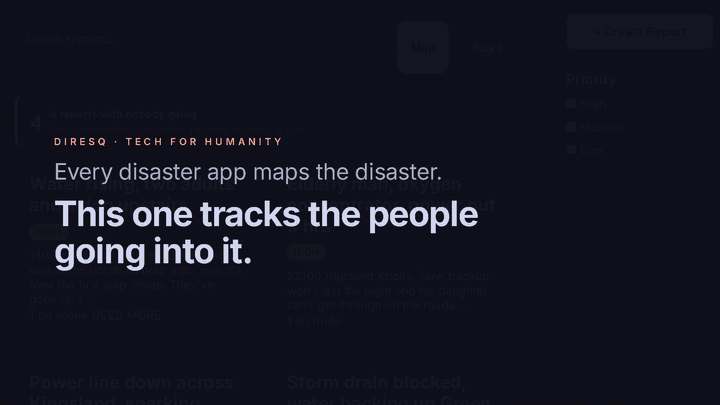

During Hurricane Harvey in 2017, ordinary people took their own fishing boats into the floodwater and pulled thousands of their neighbors off roofs. Some of them didn't come back.

Here's the detail that stuck with me: when a volunteer like that heads out, **nobody writes down that they went**. There's no dispatcher, no roster, no log. If they stop answering their phone, nothing notices. Eventually, someone realizes they haven't heard from them in a while.

One dispatcher, interviewed afterward by disaster researchers, described trying to keep track of who was out on a boat and who had come back, and asking the question nobody could answer: "can we account for everyone?"

So my teammate and I built an app that answers it. If you go out and stop checking in, it notices. And if you stay quiet long enough, it files a report about you, at the last place anyone knew you were, so someone can come find you.

It's called **DiresQ**. We built the first version in a single 14-hour night for Katy Youth Hacks 2026, the first hackathon either of us had ever entered. Then we kept building it and entered it in four more. It placed **3rd in the Software Development track at Reverie Hacks 2026**, an online hackathon with more than 2,100 participants and 423 submitted projects.

But placing isn't the interesting part. The interesting part is the three times our own code lied to us, and looked completely fine doing it.

*Five responders on scene. One goes quiet. At fifteen minutes the board turns red, and the report on the right files itself.*

## Every disaster app tracks the disaster

Crowdsourced flood maps show where the water is. Social media shows who's asking for help. Agencies have dispatch systems, but only for their own people: on a roster, carrying a radio, answering to an incident commander.

A neighbor with a boat is none of those things. Every tool we looked at mapped the incident. We couldn't find one that kept a list of the people walking into it.

Here's DiresQ in about sixty seconds:

1. A neighbor's street is flooding. She files a report: "Water rising, 2 trapped." It lands at the top of the feed, reading **0 responding**.
2. You have a boat. You see her report sitting above one that already has six people on it, so you join hers and type how long before anyone should start worrying about you: "30 min." Your row on the accountability board turns blue.
3. You arrive and mark yourself on scene. Your row turns green. It's worse than she said, so you tag the report **needs more help**, and it climbs the feed.
4. Then you go into a flooded house and stop checking in. Thirty minutes pass. Your row turns **red**, showing your last known position and how long since anyone heard from you.
5. Fifteen minutes after that, the server stops waiting for someone to notice. It files a new report, about you, at your last known position.

Nobody had to notice you went quiet. That's the product. Everything else is how you get there.

But the first version we designed would have made things worse.

## Our first design was wrong

We started with the obvious model: dispatch. One responder claims one report, it's locked, and nobody else can take it. No two people driving to the same address.

Then we read about Kathmandu in 2015 and Mexico City in 1985. In both, huge numbers of volunteers converged on a few highly visible collapse sites, while sites nearby had nobody at all. People dug at the building that was on television.

The real failure in a disaster isn't two people going to the same address. It's **six hundred people going to the same address** while the street two blocks over has no one. A claim lock fights the wrong problem, and sometimes a collapse genuinely needs forty people.

So we deleted it. Any number of people can join any report. Instead of preventing convergence, DiresQ makes it visible:

- Every report shows how many people are already on it.
- People on scene can say "we need more" or "we're overstaffed," and the feed reorders so the next person goes where the help isn't.
- When people on scene disagree, the most cautious answer wins. An optimistic report should never be able to drown out a call for help.
- A report nobody is going to sorts *above* one that's merely short-handed. A gap is worse than a queue.

That was the design. Building it was a different story.

## The first night, on two clocks

The first version was built for Katy Youth Hacks, in one 14-hour window. For me, it ran from 6pm to 8am. For my teammate, [Skythe](https://github.com/Skythe7), the same fourteen hours ran from 8am to 10pm. We were building the same app at opposite ends of the day. We met on the [Coding for Teens Discord server](https://discord.gg/zARY5CAvkh), if you're looking for a teammate of your own.

It was also my first time being part of a real team, and it felt like a preview of an actual software job. We started with a call to introduce ourselves and plan, then hung up and got to work. From there it was a steady stream of DMs, with a quick call every so often to check in. And in between came those long stretches where you just lock in and code for hours.

The first time the app actually worked was amazing. But it didn't feel like a finish line. It felt like the start of a fire. It felt good, and I immediately wanted more.

We split the code by folder, not by feature. Skythe owned the frontend: the page templates and styles. I owned the backend: the Flask app, the database schema, and the API. The one rule: **new files are free, but editing someone else's needs a message first.** We changed code in parallel all night and never once had a merge conflict.

We did have one very strange commit. At some point that night, a single commit touched 39 files, added 10,462 lines, deleted 10,462 lines, and changed nothing at all. We develop on Windows and deploy on Linux, and every line ending in the repo had silently flipped. The fix was a file most repos don't have: `.gitattributes`. (I liked it enough to write [a whole post about it]().)

We also leaned on four small libraries I'd written and published to PyPI before the hackathon: **timefuzz** turns "back in a couple hours" into a real deadline, **vitalscore** runs the START triage protocol, **pygeospy** does the map math, and **patchnotes** checks our changelog on every push.

By 8am, the git log had 65 commits from that night, and the repo had 12,579 lines of code.

Then our plan fell apart, and it was my fault.

## The plan didn't survive contact

The plan said the backend would put up fake "stub" API endpoints in the first hour, so the frontend could build against them without waiting.

The stubs were my job. I never wrote them. I was building the interesting part instead.

Skythe didn't wait, which was the right call. The git log tells the story: Skythe's first commit landed at 6:05pm my time, and by the time my first backend commit showed up at 7:40pm, there were already five complete pages in the repo, built as server-rendered templates that don't need the API at all. That turned out to be the better design: **the whole app works with JavaScript switched off.** That's exactly what you want from a tool for the worst day of someone's life, running on an old phone with one bar of signal.

What it cost us was agreement. With no stubs and no conversation, we each guessed at the other's names, and three came out different:

| Frontend | Backend |
| --- | --- |
| `HIGH` / `MEDIUM` / `LOW` | integers 1 to 4 |
| `latitude` / `longitude` | `lat` / `lng` |
| `needs_more` | `need_more` |

The frontend's names won all three times, because Skythe's templates were real, working software and my schema was still a document nobody had run.

The lesson I took: **unblock other people before you build your favorite part.** Fifteen minutes agreeing on names would have saved every one of those mismatches.

And then the code started lying to us.

## Lie #1: the classifier that scored 100%

Someone filing a report at 2am from a flooded house gets asked to pick a severity from a dropdown. They don't know. They're scared, and they aren't trained.

So DiresQ suggests one. I hand-wrote a small naive Bayes classifier, trained on 55 hand-labeled example reports. It reads your description, suggests a priority, and shows you the exact words that drove the decision. It runs in about a tenth of a millisecond with no network, and the moment you touch the dropdown yourself, it stops touching it.

We tested it the obvious way first: run it over its training data. It scored **100%**.

That number was worthless. It had simply memorized its 55 examples. So we measured it properly: hold one report out, train on the other 54, predict the one it had never seen, and repeat that 55 times.

| | Accuracy on unseen reports |
| --- | --- |
| Always guess the most common label | 36% |
| Naive Bayes alone | 45% |
| Naive Bayes plus a severity word list | 75% |

Nine points better than guessing, and wrong in the worst possible direction. "Child not breathing properly" came back MEDIUM. "Gas smell, whole street evacuating" came back LOW.

The fix was a list of the phrases the START triage protocol treats as immediate, which took it to 75%. That measurement now runs on every push, and the build fails if it ever drops below 68%. It's still wrong one time in four, which is survivable only because it's a suggestion in a dropdown you control, not a decision.

Of everything that weekend, this is what taught me the most: not building the model, but learning how to test one. Working out why it scored 100%, fixing it, and publishing both numbers instead of the flattering one.

Then we found a subtler lie. A report typed in Spanish, "mi madre no puede respirar" ("my mother can't breathe"), came back LOW, 51% confident. Naive Bayes can't say "I don't know." When every word is unfamiliar, it falls back to its base rates and outputs a label that looks like knowledge. Katy, Texas, where we set our demo, is more than a quarter Hispanic or Latino, so that isn't a hypothetical. Now, when the model doesn't recognize the wording, it gives no suggestion and says why.

**Why not just use an AI model?** Three reasons, in order:

1. **It has to explain itself.** The words DiresQ shows you are the actual math behind the decision, not a separately generated explanation that could disagree with it.
2. **It has to be honest about being wrong.** A confident paragraph from a language model is much harder to doubt, and confidently wrong sends boats to the wrong street.
3. **It has to work with the cell towers down.** No download, no API key, no network. So the same trained model runs on the phone, too.

(We did use AI tools while building DiresQ, for code and documentation. There's just none inside the product.)

Putting the model on the phone led to the strangest bug of the whole project. We'll get there. First, the alarm.

## Lie #2: the alarm that could die quietly

The dead man's switch, the part that files a report when you go quiet, started life as a background timer inside the app.

Then we thought about what happens when a background timer crashes: nothing. No error on screen. The board keeps rendering, every row stays green, and green reads as "everyone's fine" when it really means "nobody's checking."

So we deleted the timer. DiresQ never stores whether someone is overdue. It works that out fresh every time someone loads the board, and runs the escalation check at the same moment. There's nothing to forget to start, and nothing that can silently die.

That left one honest dependency: if nobody has the board open, nothing gets checked. So the board shows when the check last ran, **"checked 2s ago,"** and turns amber if it ever stops. The thing that notices when people go quiet won't go quiet without saying so. (There's also a command you can run on a schedule, so the alarm doesn't depend on someone having a tab open.)

That became the theme of the whole project: **the failure that matters is the one that leaves no trace.**

## Lie #3: bugs that looked like working features

Every bug below passed its tests, threw no errors, and looked fine. We only found them by using the code for real.

- **Error messages that went nowhere.** The backend reported errors in five places, like a wrong password, but no page ever displayed them. A rejected form just sat there looking frozen.
- **A required field that wasn't.** The report form required hidden latitude and longitude fields. Browsers skip validation on hidden fields, so a report submitted without a map pin saved with no location: invisible on the map, forever.
- **A database that broke on the second run.** A table added late got created but never dropped, so rebuilding an existing database stopped halfway and left it in pieces. Every test passed, because tests start from an empty database, and empty is the one case that always works.
- **A phishing hole we built by accident.** After you logged in, the app sent you to whatever address the link's `?next=` parameter said. So a link to our real login page, on our real domain, could hand you straight to someone else's site. The tests only checked that logging in redirected you, which it did.
- **A map that would run whatever people typed.** Report titles went into the map's pop-ups as raw HTML. A title containing the right HTML, like an image tag with an error handler, would have run its code in the browser of everyone who opened the map. We caught it at 4:36am and rebuilt the pop-ups so that text is only ever treated as text.
- **A security check that searched nothing.** Our CI scanned for hardcoded secrets. The fix landed four minutes after the scan did: a quoting mistake in the YAML crashed it before it searched a single file, and the failure looked like any other. We rewrote it in Python and tested it against a deliberately leaky file to prove it catches real ones.

And the strangest one, from putting the classifier on the phone. We ran every example through both versions, Python on the server and JavaScript in the browser, with a test that fails on any disagreement. It found a bug within minutes: the words shown behind a suggestion were sorted by floating-point noise, because Python and V8 (the JavaScript engine in Chrome and Node) round logarithms differently in the very last bit. That bug had been in the Python since day one. With only one implementation, it was invisible.

## The things we refused to build

A tool that looks like an emergency service can do real harm by looking more capable than it is. So we wrote down everything DiresQ doesn't do, and put that list inside the app.

- **No identity verification.** Anyone can sign up. Doing it properly needs real ID checks, and there's no honest weekend version. A fake check, like email confirmation, would be worse than nothing, because it looks like verification without being it.
- **No calling 911.** DiresQ never contacts emergency services or implies that it has. The worst failure would be someone filing a report and believing help is on the way.
- **No radio, yet.** A check-in packs into 22 signed bytes, small enough for a LoRa long-range radio, with a replay counter so a captured packet can't simply be sent again. There's even a gateway script to forward packets to the server. What doesn't exist is the radio: we don't have the hardware, and untested code isn't a feature. It's a file that looks like one.

DiresQ has never been used in a real disaster, and it shouldn't be until someone who does this professionally has taken it apart.

## It wasn't one night

The 14 hours were only Katy Youth Hacks. That wanting-more feeling from the first night never went away: we kept building DiresQ and entered it in four more hackathons: STEMist Hacks IV, Reverie Hacks, the Girls In STEM Global Hackathon, and the CSC Summer Impactathon. Here's roughly what the git log says, in my time zone:

| When (Pacific time) | Hours | Commits | What happened |
| --- | --- | --- | --- |
| Sat Aug 1, 6pm to Sun 8am | 14.0 | 65 | Katy Youth Hacks: the whole app, from an empty repo |
| Sun 3pm to Mon 6am | 14.7 | 40 | Works offline and installs on a phone; releases 1.0.0 to 1.0.2 |
| Mon 6pm to Tue 2am | 7.6 | 30 | Map fixes, then reading the research and writing a paper |
| Wednesday | 2.5 | 12 | A demo clock for filming, an accessibility pass, release 1.1.0 |

The hours run from the first commit to the last in each session, so the real total is higher: reading, testing, and filming between commits don't show up. Even so, that's about 39 hours of commits over just over four days: 147 commits (plus five setup commits from the week before), four tagged releases, and a docs site that rebuilds itself from the repo on every push. The test suite grew from 344 tests in our Katy Youth Hacks submission to 606 test functions. GitHub Actions has run 288 times so far, mostly the tests, the security scan, and the changelog check that run on every push.

Here's what those extra hours bought:

- **It works with no signal.** Reports and check-ins save to your phone first and send themselves when you reconnect. Each one gets its ID before the first attempt, so a phone that dies mid-send can't file the same emergency twice.
- **It passed an accessibility audit.** A WCAG 2.1 AA audit found 22 issues across four passes, six of them critical. We fixed all 22, and a test holds each fix in place.
- **It turned into a paper.** By the third evening, we realized the interesting claim wasn't the app. It was the gap. So we read the research to check whether the gap was real, going back to the primary sources. One commit message from that night: "Read the 1957 original instead of citing it secondhand." That reading became an eleven-page preprint, which says plainly that DiresQ has no users, no deployment, and no evaluation.
- **It learned to be filmed.** The dead man's switch only does something after fifteen minutes of silence, which makes for a terrible demo video. So DiresQ got a scaled clock: at 60x speed, a responder goes overdue five seconds after the page loads, and the report about them arrives fifteen seconds after that. It's the exact same escalation code, and a banner on screen admits that time is sped up.

Then we entered Reverie Hacks 2026.

## 3rd place

I found out in the middle of a marine biology lecture. We got a two-minute break to drink some water and rest our brains, I checked my phone, and there was a DM from Skythe: we'd placed.

I was freaking out internally. All I wanted to do was watch the hackathon's showcase video on YouTube, check Discord, check Devpost, check everything. Instead, I had to sit through the rest of the lecture.

The second it ended, it all hit me, and every hour felt worth it. I even told my parents, even though they don't understand any of the coding and tech stuff.

Reverie Hacks drew more than 2,100 participants and 423 submitted projects across six tracks. DiresQ took 3rd place in the Software Development track. Not bad for a project that started as our first hackathon ever.

### What the judges said

Two judges scored DiresQ out of 105 points. One gave it 96, the other 94.

| Category | Max | Judge 1 | Judge 2 |
| --- | --- | --- | --- |
| Real-world problem and impact | 25 | 24 | 25 |
| Technical execution | 25 | 24 | 25 |
| Innovation and originality | 15 | 14 | 12 |
| User experience and design | 15 | 13 | 12 |
| Sustainability and scalability | 10 | 8 | 6 |
| Presentation and communication | 10 | 10 | 10 |
| Bonus: exceptionality | +5 | 3 | 4 |
| **Total** | **105** | **96** | **94** |

The first judge summed up the project better than I could. The strongest part, they wrote, wasn't the amount of functionality but the reasoning behind it: "the team repeatedly identifies dangerous failure modes, measures them, and designs around them." That's the whole project in one sentence.

The bonus points stand out, too. The rubric told judges that the bonus was reserved for the rare project that goes beyond it, and that most projects should get zero, by design. Both judges gave DiresQ some: 3 points and 4. The second judge's reason was how complete and disciplined the whole project was for our level.

They also read the code, not just the writeup. The second judge noted the exact commit they reviewed, which was the last one we pushed, and admitted to getting through about half the files.

The criticism was fair, too:

- **It's unproven.** Both judges pointed out that DiresQ has never been used in a real disaster, learned from only 55 examples, and relies on self-reported locations. The first judge noted that being upfront about those limits made the submission more credible, but also means its real-world effectiveness is still unproven.
- **The writeup was ahead of the interface.** The second judge found that some flows we described, like joining a report and voting on staffing, looked rougher in the actual app than in our writeup. That's a fair hit.
- **Scale isn't solved.** Moderation, identity checks, and hosting costs at scale are all written down, but none of them are solved. Sustainability was our lowest-scoring category on both sheets.

Both criticisms point to the same next step, and it isn't a feature. It's talking to people who have actually coordinated volunteers in a disaster, to find out whether the gap we designed for is as real as it looks from the research.

## What I'd tell myself before the next hackathon

- **Name your dependencies out loud.** If someone is waiting on you, that's the first thing you do, not a line in a planning doc.
- **Agree on names and shapes in writing before you start.** It takes fifteen minutes.
- **Write the first test early.** Ours found two real bugs within minutes of existing.
- **Test on a database that already has data in it.** Empty is the one case that always works.
- **Treat 100% as a warning, not a result.** Measure the clever version before you keep it.
- **Write your limitations while you build.** It's the only time you actually remember what you decided not to handle.
- **Don't let the writeup get ahead of the interface.** A judge will open the app and check.

## Try it

- **Live demo:** [diresq.onrender.com](https://diresq.onrender.com). Sign in as `londo` with the password `diresq`. It's on a free tier, so the first load can take about a minute to wake up.
- **Demo video:** [YouTube](https://youtu.be/T0Udg9WgRYA)
- **Docs:** [skythe7.github.io/DiresQ](https://skythe7.github.io/DiresQ)
- **Code:** [github.com/Skythe7/DiresQ](https://github.com/Skythe7/DiresQ)
- **Devpost:** [DiresQ on Devpost](https://devpost.com/software/diresq-8zjngi)

Built by Skythe (frontend) and me (backend).

## Closing thought

Back to that dispatcher's question: can we account for everyone?

With DiresQ, the answer is either yes, or a red row with a name, a last known position, and a report that's already been filed.

Nobody has to notice you went quiet.
